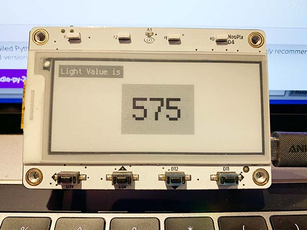

# MagTagLightSensor
Displays the light value on the ePaper screen of a MagTag from Adafruit

You will need a magtag https://www.adafruit.com/product/4800 from Adafruit.

The code is written in CircuitPython. Chances are, your MagTag is already set up. 

You will need to transfer "code.py" from this repository onto your MagTag.

The code uses a few libraries, pre-written code that makes things work on your device. The code currently uses the 7.0 version of CircuitPython and the associated libraries for 7.0. 

Adafruit Helper information that is specific to MagTag https://circuitpython.readthedocs.io/projects/magtag/en/latest/

Installing CircuitPython on your MagTag https://learn.adafruit.com/adafruit-magtag/circuitpython

CircuitPython Libraries https://circuitpython.org/libraries

All the code I used is really re-used Adafruit examples.

# Important Libraries to Include in your Lib folder

- adafruit_display_text
- adafruit_magtag
- adafruit_simple_text_display.mpy
- simpleio.mpy
